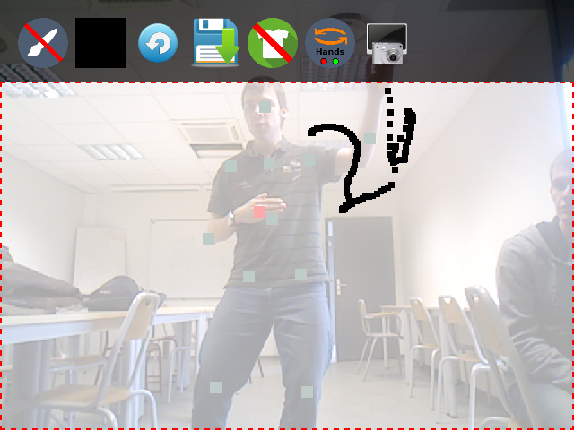

# AR_GUI
AR pour Augmented Reality et GUI pour ... Graphical User Interface.

### Utilisation initiale ###
Pour avoir une idée de comment installer tout ce bazar, la première commande à taper est :

make doc

Ensuite, un readMe.html sera crée dans le répertoire courant, lisez le, et suivez pas à pas la procédure d'installation.
Si tout s'est bien passé, vous serez en mesure d'utiliser notre projet.

Enfin bref, en image :

	

